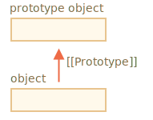
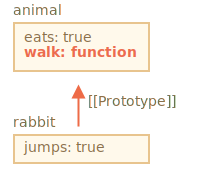
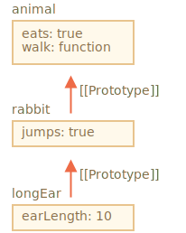
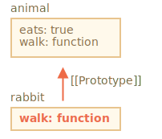
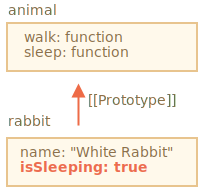
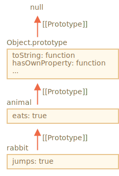

# 프로토타입 상속

개발을 하다 보면 기존에 있는 기능을 가져와 확장해야 하는 경우가 생깁니다.

사람에 관한 프로퍼티와 메서드를 가진 `user`라는 객체가 있는데, `user`와 상당히 유사하지만 약간의 차이가 있는 `admin`과 `guest` 객체를 만들어야 한다고 가정해 봅시다. 이때 `user`의 메서드를 복사하거나 다시 구현하지 않고 `user`에 약간의 기능을 얹어 `admin`과 `guest` 객체를 만들 수 있을겁니다.

*프로토타입 상속(prototypal inheritance)* 은 이럴 때 사용할 수 있는 기능입니다.

## [[Prototype]]

자바스크립트에서 객체는 명세서에서 명명한 `[[Prototype]]`이라는 숨김 프로퍼티를 가지고 있는데, 그 값은 `null`이거나 다른 객체에 대한 참조가 됩니다. 만약 다른 객체를 참조하고 있다면 참조 대상을 '프로토타입(prototype)'이라 부릅니다. 



프로토타입의 동작 방식은 '신비스러운'면이 있습니다. `object`에서 프로퍼티를 읽으려고 하는데 해당 프로퍼티가 없으면 자바스크립트는 자동으로 프로토타입에서 프로퍼티를 찾기 때문이죠. 프로그래밍에선 이런 동작 방식을 '프로토타입 상속'이라 부릅니다. 언어 차원에서 지원하는 편리한 기능이나 개발 테크닉 중 프로토타입 상속에 기반해 만들어진 것들이 많습니다.

`[[Prototype]]` 프로퍼티는 내부 프로퍼티이면서 숨김 프로퍼티이지만 개발자가 값을 설정할 수 있습니다.

아래 예시처럼 `__proto__`을 사용하면 됩니다.

```js run
let animal = {
  eats: true
};
let rabbit = {
  jumps: true
};

*!*
rabbit.__proto__ = animal;
*/!*
```

```smart header="`__proto__`는 `[[Prototype]]`용 getter/setter입니다."
`__proto__`는 `[[Prototype]]`과 *다릅니다*. `__proto__`는 `[[Prototype]]`의 getter(획득자)/setter(설정자) 입니다.

<<<<<<< HEAD
하위 호환성 때문에 `__proto__`를 여전히 쓸 순 있지만 비교적 근래에 작성된 스크립트에선 `__proto__`대신 함수 `Object.getPrototypeOf`나 `Object.setPrototypeOf`을 써서 프로토타입을 획득(get)하거나 설정(set)합니다. 근래엔 왜 `__proto__`를 쓰지 않는지와 두 함수의 자세한 설명에 대해선 이어지는 챕터에서 다룰 예정입니다.
=======
It exists for historical reasons. In modern language it is replaced with functions `Object.getPrototypeOf/Object.setPrototypeOf` that also get/set the prototype. We'll study the reasons for that and these functions later.
>>>>>>> 79417c6e73645d37f184f0cc7e4bc3353e85224f

`__proto__`는 브라우저 환경에서만 지원하도록 자바스크립트 명세에서 규정하였는데, 
실상은 서버 사이드를 포함한 모든 호스트 환경에서 `__proto__`를 지원합니다. `[[Prototype]]`보다는 `__proto__`가 조금 더 직관적이어서 이해하기 쉬우므로, 본 튜토리얼에선 `__proto__`를 사용해 예시를 만들도록 하겠습니다. 
```

객체 `rabbit`에서 프로퍼티를 얻고싶은데 해당 프로퍼티가 없다면, 자바스크립트는 자동으로 `animal`이라는 객체에서 프로퍼티를 얻습니다.

예시:

```js
let animal = {
  eats: true
};
let rabbit = {
  jumps: true
};

*!*
rabbit.__proto__ = animal; // (*)
*/!*

// 프로퍼티 eats과 jumps를 rabbit에서도 사용할 수 있게 되었습니다.
*!*
alert( rabbit.eats ); // true (**)
*/!*
alert( rabbit.jumps ); // true
```

`(*)`로 표시한 줄에선 `animal`이 `rabbit`의 프로토타입이 되도록 설정하였습니다.

`(**)`로 표시한 줄에서 `alert` 함수가 `rabbit.eats` 프로퍼티를 읽으려 했는데, `rabbit`엔 `eats`라는 프로퍼티가 없습니다. 이때 자바스크립트는 `[[Prototype]]`이 참조하고 있는 객체인 `animal`에서 `eats`를 얻어냅니다(아래 그림을 밑에서부터 위로 살펴보세요).


이제 "`rabbit`의 프로토타입은 `animal`입니다."나 "`rabbit`은 `animal`을 상속받는다."라고 할 수 있게 되었네요.

덕분에 `rabbit`에서도 `animal`에 구현된 유용한 프로퍼티와 메서드를 사용할 수 있게 되었습니다. 이렇게 프로토타입에서 상속받은 프로퍼티를 '상속 프로퍼티(inherited property)'라고 합니다.

`animal`에 정의된 메서드를 `rabbit`에서 호출해 봅시다.

```js run
let animal = {
  eats: true,
*!*
  walk() {
    alert("동물이 걷습니다.");
  }
*/!*
};

let rabbit = {
  jumps: true,
  __proto__: animal
};

// 메서드 walk는 rabbit의 프로토타입인 animal에서 상속받음
*!*
rabbit.walk(); // 동물이 걷습니다.
*/!*
```

아래 그림과 같이 프로토타입(`animal`)에서 `walk`를 자동으로 상속받았기 때문에 `rabbit`에서도 `walk`를 호출할 수 있습니다.



프로토타입 체인은 위 예시보다 더 길어질 수도 있습니다.

```js run
let animal = {
  eats: true,
  walk() {
    alert("동물이 걷습니다.");
  }
};

let rabbit = {
  jumps: true,
*!*
  __proto__: animal
*/!*
};

let longEar = {
  earLength: 10,
*!*
  __proto__: rabbit
*/!*
};

// 메서드 walk는 프로토타입 체인에서 얻어옴
longEar.walk(); // 동물이 걷습니다.
alert(longEar.jumps); // true (rabbit에서 상속받음)
```



프로토타입 체이닝엔 두 가지 제약사항이 있습니다.

1. 순환 참조(circular reference)는 허용되지 않습니다. `__proto__`를 이용해 닫힌 형태로 다른 객체를 참조하면 에러가 발생합니다.
2. `__proto__`의 값은 객체나 `null`만 가능합니다. 다른 자료형은 무시됩니다.

여기에 더하여 객체엔 오직 하나의 `[[Portotype]]`만 있을 수 있다는 당연한 제약도 있습니다. 객체는 두 개의 객체를 상속받지 못합니다.

## 쓸 때는 프로토타입을 사용하지 않습니다.

프로토타입은 프로퍼티를 읽을 때만 사용합니다.

프로퍼티를 추가, 수정하거나 지우는 연산은 객체에 직접 해야 합니다.

아래 예시에선 객체 `rabbit`에 메서드 `walk`를 직접 할당합니다.

```js run
let animal = {
  eats: true,
  walk() {
    /* rabbit은 이제 이 메서드를 사용하지 않습니다. */  
  }
};

let rabbit = {
  __proto__: animal
};

*!*
rabbit.walk = function() {
  alert("토끼가 깡충깡충 뜁니다.");
};
*/!*

rabbit.walk(); // 토끼가 깡충깡충 뜁니다.
```

`rabbit.walk()`를 호출하면 프로토타입에 있는 메서드가 실행되지 않고, 객체 `rabbit`에 추가한 메서드가 실행됩니다. 



한편, 접근자 프로퍼티(accessor property)는 setter 함수를 통해서 프로퍼티에 값을 할당하므로 이 규칙이 적용되지 않습니다. 접근자 프로퍼티에 값을 할당하는 것은 함수를 호출하는 것과 같기 때문입니다.

아래 예시에서 `admin.fullName`이 의도한 대로 잘 작동하는 것을 확인할 수 있습니다.

```js run
let user = {
  name: "John",
  surname: "Smith",

  set fullName(value) {
    [this.name, this.surname] = value.split(" ");
  },

  get fullName() {
    return `${this.name} ${this.surname}`;
  }
};

let admin = {
  __proto__: user,
  isAdmin: true
};

alert(admin.fullName); // John Smith (*)

// setter 함수가 실행됩니다!
admin.fullName = "Alice Cooper"; // (**)
```

`(*)`로 표시한 줄에서 `admin.fullName`은 프로토타입에 있는 getter 함수를 실행시키고, `(**)`로 표시한 줄의 할당 연산은 프로토타입에 있는 setter 함수를 실행시킵니다.

## 'this'가 나타내는 것

<<<<<<< HEAD
위 예시를 보면서 "`set fullName(value)`안 `this`의 값은 무엇이지?"라는 의문이 생길 수 있습니다. "프로퍼티 `this.name`과 `this.surname`에 값을 쓰면 그 값이 `user`에 저장될까, 아니면 `admin`에 저장될까?"라는 의문도 생길 수 있죠.
=======
An interesting question may arise in the example above: what's the value of `this` inside `set fullName(value)`? Where are the properties `this.name` and `this.surname` written: into `user` or `admin`?
>>>>>>> 79417c6e73645d37f184f0cc7e4bc3353e85224f

답은 간단합니다. `this`는 프로토타입에 전혀 영향을 받지 않습니다.

**메서드를 객체에서 호출했든 프로토타입에서 호출했든 상관없이 `this`는 언제나 `.` 앞에 있는 객체가 됩니다.**

`admin.fullName=`으로 setter 함수를 호출할 때, `this`는 `user`가 아닌 `admin`이 되죠.

메서드가 많이 구현되어있는 중심 객체 하나를 만들고, 이 객체를 상속받는 다양한 객체를 구현하는 경우가 많기 때문에 이런 특징을 잘 알아두셔야 합니다. 상속받은 메서드를 사용하더라도 객체는 프로토타입이 아닌 자신의 상태를 수정합니다.

예시를 통해 좀 더 알아봅시다. '메서드 저장소' 역할을 하는 객체 `animal`을 `rabbit`이 상속받고 있는 상황입니다.

`rabbit.sleep()`을 호출하면 `this.isSleeping`이 객체 `rabbit`에 설정되겠죠.

```js run
// animal엔 다양한 메서드가 있습니다.
let animal = {
  walk() {
    if (!this.isSleeping) {
      alert(`동물이 걸어갑니다.`);
    }
  },
  sleep() {
    this.isSleeping = true;
  }
};

let rabbit = {
  name: "하얀 토끼",
  __proto__: animal
};

// rabbit의 프로퍼티 isSleeping을 true로 변경합니다.
rabbit.sleep();

alert(rabbit.isSleeping); // true
alert(animal.isSleeping); // undefined (프로토타입에는 isSleeping이라는 프로퍼티가 없습니다.)
```

위 코드를 실행한 후, 객체의 상태를 그림으로 나타내면 다음과 같습니다.



<<<<<<< HEAD
`rabbit` 말고도 `bird`, `snake` 등이 `animal`을 상속받는다고 해봅시다. 이 객체들도 `rabbit`처럼 `animal`에 구현된 메서드를 사용할 수 있겠죠. 이때 상속받은 메서드의 `this`는 `animal`이 아닌 실제 메서드가 호출되는 시점의 점(`.`) 앞에 있는 객체가 됩니다. 따라서 `this`에 데이터를 쓰면 `animal`이 아닌 해당 객체의 상태가 변화합니다.
=======
If we had other objects, like `bird`, `snake`, etc., inheriting from `animal`, they would also gain access to methods of `animal`. But `this` in each method call would be the corresponding object, evaluated at the call-time (before dot), not `animal`. So when we write data into `this`, it is stored into these objects.
>>>>>>> 79417c6e73645d37f184f0cc7e4bc3353e85224f

결론을 말씀드리자면 메서드는 공유되지만, 객체의 상태는 공유되지 않습니다.

## for..in 반복문

<<<<<<< HEAD
`for..in`은 상속 프로퍼티도 순회대상에 포함시킵니다.
=======
The `for..in` loop iterates over inherited properties too.
>>>>>>> 79417c6e73645d37f184f0cc7e4bc3353e85224f

예시:

```js run
let animal = {
  eats: true
};

let rabbit = {
  jumps: true,
  __proto__: animal
};

*!*
<<<<<<< HEAD
// Object.keys는 객체 자신의 키만 반환합니다.
=======
// Object.keys only returns own keys
>>>>>>> 79417c6e73645d37f184f0cc7e4bc3353e85224f
alert(Object.keys(rabbit)); // jumps
*/!*

*!*
// for..in은 객체 자신의 키와 상속 프로퍼티의 키 모두를 순회합니다. 
for(let prop in rabbit) alert(prop); // jumps, eats
*/!*
```

[obj.hasOwnProperty(key)](mdn:js/Object/hasOwnProperty)를 이용하면 상속 프로퍼티를 순회 대상에서 제외할 수 있습니다. 이 내장 메서드는 `key`에 대응하는 프로퍼티가 상속 프로퍼티가 아니고 `obj`에 직접 구현되어있는 프로퍼티라면 `true`를 반환합니다.

`obj.hasOwnProperty(key)`를 사용하면 아래 예시에서처럼 상속 프로퍼티를 걸러낼 수 있고, 상속 프로퍼티만을 대상으로 무언가를 할 수도 있습니다.

```js run
let animal = {
  eats: true
};

let rabbit = {
  jumps: true,
  __proto__: animal
};

for(let prop in rabbit) {
  let isOwn = rabbit.hasOwnProperty(prop);

  if (isOwn) {
    alert(`객체 자신의 프로퍼티: ${prop}`); // 객체 자신의 프로퍼티: jumps
  } else {
    alert(`상속 프로퍼티: ${prop}`); // 상속 프로퍼티: eats
  }
}
```

위 예시의 상속 관계를 그림으로 나타내면 다음과 같습니다. `rabbit`은 `animal`을, `animal`은 `Object.prototype`을, `Object.prototype`은 `null`을 상속받습니다(`animal`은 객체 리터럴 방식으로 선언하였기 때문에 `Object.prototype`를 상속받습니다).



`for..in` 안에 쓰인 메서드 `hasOwnProperty`는 `Object.prototype.hasOwnProperty`에서 왔다는 것을 그림을 통해 알 수 있습니다.

엇? 그런데 상속 프로퍼티인 `eats`는 얼럿 창에 출력되는데, `hasOwnProperty`는 출력되지 않았습니다. 무슨 일이 있는 걸까요?

이유는 간단합니다. `hasOwnProperty`는 열거 가능한(enumerable) 프로퍼티가 아니기 때문입니다. `Object.prototype`에 있는 모든 메서드의 `enumerable` 플래그는 `false`인데, `for..in`은 오직 열거 가능한 프로퍼티만 순회 대상에 포함하기 때문에 `hasOwnProperty`는 얼럿창에 출력되지 않습니다.

```smart header="키-값을 순회하는 메서드 대부분은 상속 프로퍼티를 제외하고 동작합니다."
`Object.keys`, `Object.values` 같이 객체의 키-값을 대상으로 무언가를 하는 메서드 대부분은 상속 프로퍼티를 제외하고 동작합니다.

프로토타입에서 상속받은 프로퍼티는 *제외하고*, 해당 객체에서 정의한 프로퍼티만 연산 대상에 포함합니다.
```

## 요약

- 자바스크립트의 모든 객체엔 숨김 프로퍼티 `[[Prototype]]`이 있는데, 이 프로퍼티는 객체나 `null`을 가리킵니다.
- `obj.__proto__`를 사용하면 프로토타입에 접근할 수 있습니다. `__proto__`는 `[[Prototype]]`의 getter/setter로 쓰이는데, 요즘엔 잘 쓰지 않습니다. 자세한 사항은 뒤쪽 챕터에서 다룰 예정입니다.
- `[[Prototype]]`이 참조하는 객체는 '프로토타입'이라 부릅니다.
- `obj`에서 프로퍼티를 읽거나 메서드를 호출하려 하는데 해당하는 프로퍼티나 메서드가 없으면 자바스크립트는 프로토타입에서 프로퍼티나 메서드를 찾습니다. 
- 접근자 프로퍼티가 아닌 데이터 프로퍼티를 다루고 있다면, 쓰기나 지우기와 관련 연산은 프로토타입을 통하지 않고 객체에 직접 적용됩니다.
- 프로토타입에서 상속받은 `method`라도 `obj.method()`를 호출하면 `method` 안의 `this`는 호출 대상 객체인 `obj`를 가리킵니다.
- `for..in` 반복문은 객체 자체에서 정의한 프로퍼티뿐만 아니라 상속 프로퍼티도 순회 대상에 포함합니다. 반면, 키-값과 관련된 내장 메서드 대부분은 상속 프로퍼티는 제외하고 객체 자체 프로퍼티만을 대상으로 동작합니다.