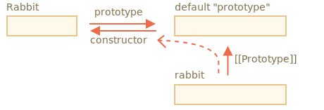

# F.prototype

새로운 객체는 `new F()`와 같은 생성자 함수로 만들 수 있습니다.

`F.prototype`이 객체라면, `new` 연산자는 새로운 객체의 `[[Prototype]]`을 설정하기 위해 `F.proptype`을 사용합니다.

```smart
자바스크립트는 처음부터 프로토타입 상속을 가지고 있었습니다. 자바스크립트의 중요 특징 중 하나입니다.

그러나 초기에는, 직접적으로 프로토타입에 접근할 수 있는 방법이 없었습니다. 신뢰할 만한 유일한 방법은 이 챕터에서 설명한 생성자 함수의 `"프로토타입"` 프로퍼티입니다. 따라서 아직까지 여러 자바스크립트 파일은 이 방법을 사용합니다.
```

`F.prototype`은 여기서 `F`안에 `"prototype"`이라는 일반적인 프로퍼티임을 알아두세요. "원형"이라는 용어랑 비슷하게 들리겠지만, 여기서 진정으로 말하고자 하는 것은 이 이름으로 쓰이는 일반적인 프로퍼티입니다.

예를 들어봅시다.

```js run
let animal = {
  eats: true
};

function Rabbit(name) {
  this.name = name;
}

*!*
Rabbit.prototype = animal;
*/!*

let rabbit = new Rabbit("White Rabbit"); //  rabbit.__proto__ == animal

alert( rabbit.eats ); // true
```

`Rabbit.prototype = animal`을 설정하는 것은 말 그대로 다음을 뜻합니다. "`new Rabbit`이 생성되었을 때, 이것의 `[[Prototype]]`을 `animal`로 할당하라"

이게 결과 화면입니다.


위 그림에서 가로 화살표는 일반 프로퍼티인 `"prototype"`, 세로 화살표는 `[[Prototype]]`을 나타냅니다. 세로 화살표는 `rabbit`이 `animal`로 부터 상속받았다는 것을 의미합니다.

```smart header="`new F`가 호출되었을 때만 `F.prototype` 사용"

`F.prototype` 프로퍼티는 `new F`가 호출되었을 때만 사용되며, 새 객체의 `[[Prototype]]]`을 할당합니다. 그 후, 새로운 객체와  `F.prototype`은 관련이 없습니다. `일회성 선물`이라고 생각하세요.

만약 생성 후에 `F.prototype` 프로퍼티가 변한다면(`F.prototype=<다른 객체>`), `new F`에 의해 생성된 새로운 객체는 `[[Prototype]]`으로 다른 객체를 가질 것입니다. 그러나 이미 생성된 객체는 이전 객체를 유지합니다.
```


## 기본 F.prototype, 생성자 프로퍼티

우리가 제공하지 않더라도 모든 함수는 "prototype" 프로퍼티를 갖습니다.  

기본값의 `"prototype"`은 단 하나의 프로퍼티 `constructor`을 갖습니다. 이 프로퍼티는 함수 자기 자신을 가리킵니다.  

이렇게 말이죠.

```js
function Rabbit() {}

/* 기본값의 프로토타입
Rabbit.prototype = { constructor: Rabbit };
*/
```


다음과 같이 이것을 확인할 수 있습니다.

```js run
function Rabbit() {}
// 기본적으로
// Rabbit.prototype = { constructor: Rabbit }

alert( Rabbit.prototype.constructor == Rabbit ); // true
```

자연적으로, 아무것도 하지 않는다면, `constructor` 프로퍼티는 모든 rabbit에서 `[[Prototype]]`을 통해 접근 가능합니다.

```js run
function Rabbit() {}
// 기본적으로
// Rabbit.prototype = { constructor: Rabbit }

let rabbit = new Rabbit(); // {constructor: Rabbit}으로부터 상속

alert(rabbit.constructor == Rabbit); // true(프로토타입으로부터)
```



우리는 이미 존재하는 것과 동일한 `constructor` 프로퍼티를 이용해서 새로운 객체를 만들 수 있습니다. 

이렇게요.

```js run
function Rabbit(name) {
  this.name = name;
  alert(name);
}

let rabbit = new Rabbit("White Rabbit");

*!*
let rabbit2 = new rabbit.constructor("Black Rabbit");
*/!*
```

이것은 우리가 어떤 객체를 가지고 같은 종류의 객체를 만들고 싶지만 어떤 생성자가 사용되었는지 모를 때 유용합니다(예를 들어, 제3의 라이브러리에서 사용하는 경우).

하지만 무엇보다도 `"constructor"`에 관해 가장 중요한 것은...

**...자바스크립트 자체는 `"constructor"` 값을 보장하지 않는다**는 것입니다.

맞습니다, 함수에는 기본값의 `"prototype"`에 `constructor`가 존재합니다. 하지만 그게 다입니다. 나중에 어떤 일이 `"constructor"`에 생길지는 전적으로 우리에게 달려있습니다.

특별한 경우, 기본값의 프로토타입을 통째로 대체한다면, `"constructor"`는 그 안에 없을 것입니다.

예를 들어:

```js run
function Rabbit() {}
Rabbit.prototype = {
  jumps: true
};

let rabbit = new Rabbit();
*!*
alert(rabbit.constructor === Rabbit); // false
*/!*
```

그래서, `constructor`를 유지하기 위해서는 전체를 덮어쓰기보다는 기본값의 `"prototype"`에서 추가/제거할 프로퍼티를 선택할 수 있습니다. 

```js
function Rabbit() {}

// Rabbit.prototype 전체를 덮어쓰지 마세요.
// 그냥 추가하세요.
Rabbit.prototype.jumps = true
// 기본값의 Rabbit.prototype.constructor는 유지됩니다.
```

혹은 다른 방법으로,  `constructor`프로퍼티를 일일이 재생성시킬 수도 있겠죠.

```js
Rabbit.prototype = {
  jumps: true,
*!*
  constructor: Rabbit
*/!*
};

// 우리가 추가했기 때문에 생성자 또한 올바릅니다.
```


## 요약

이번 주제에서 간단하게 생성자 함수를 통해 생성된 객체의 `[[Prototype]]`을 설정하는 방법에 대하여 알아보았습니다. 나중에 이것을 바탕으로 더 고급 프로그래밍 패턴을 알아보도록 합시다.

모든 것이 간단합니다. 몇 가지만 명확하게 알아두면 됩니다.

- `F.prototype` 프로퍼티는 `[[prototype]]`과 다릅니다. `F.prototype` 은 `new F()` 가 호출됐을 때 새로운 객체의 `[[Prototype]]`을 설정하는 일 한 가지만 합니다.
- `F.prototype` 의 값은 객체이거나 null입니다. 다른 값은 적용이 안 됩니다.
- `"prototype"` 프로퍼티는 특별한 효과만 가지고 있습니다. `new` 와 함께 호출될 때, 생성자 함수로 설정될 때 그 효과가 일어납니다.

일반적인 객체의 `prototype`은 전혀 특별하지 않습니다.
```js
let user = {
  name: "John",
  prototype: "Bla-bla" // 특별하지 않습니다.
};
```

기본값으로 모든 함수는 `F.prototype = { constructor : F }`를 가지고 있습니다, 그래서 우리는 `"constructor"` 프로퍼티를 통해서 어떤 객체의 생성자를 얻을 수 있습니다.
