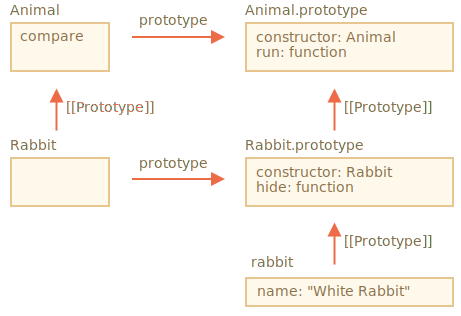

# 정적 메서드와 정적 프로퍼티

`"prototype"`이 아닌 클래스 함수 자체에 메서드를 설정할 수도 있습니다. 이런 메서드를 *정적(static)* 메서드라고 부릅니다.

정적 메서드는 아래와 같이 클래스 안에서 `static` 키워드를 붙여 만들 수 있습니다.

```js run
class User {
*!*
  static staticMethod() {
*/!*
    alert(this === User);
  }
}

User.staticMethod(); // true
```

정적 메서드는 메서드를 프로퍼티 형태로 직접 할당하는 것과 동일한 일을 합니다. 

```js run
<<<<<<< HEAD
class User() { }
=======
class User { }
>>>>>>> 14e4e9f96bcc2bddc507f409eb4716ced897f91a

User.staticMethod = function() {
  alert(this === User);
};

User.staticMethod(); // true
```

`User.staticMethod()`가 호출될 때 `this`의 값은 클래스 생성자인 `User` 자체가 됩니다(점 앞 객체).

정적 메서드는 어떤 특정한 객체가 아닌 클래스에 속한 함수를 구현하고자 할 때 주로 사용됩니다.

객체 `Article`이 여러 개 있고 이들을 비교해줄 함수가 필요하다고 가정해 봅시다. 가장 먼저 아래와 같이 `Article.compare`를 추가하는 방법이 떠오를 겁니다.

```js run
class Article {
  constructor(title, date) {
    this.title = title;
    this.date = date;
  }

*!*
  static compare(articleA, articleB) {
    return articleA.date - articleB.date;
  }
*/!*
}

// 사용법
let articles = [
  new Article("HTML", new Date(2019, 1, 1)),
  new Article("CSS", new Date(2019, 0, 1)),
  new Article("JavaScript", new Date(2019, 11, 1))
];

*!*
articles.sort(Article.compare);
*/!*

alert( articles[0].title ); // CSS
```

여기서 `Article.compare`는 article(글)을 비교해주는 수단으로, 글을 '위에서' 바라보며 비교를 수행합니다. `Article.compare`이 글의 메서드가 아닌 전체 클래스의 메서드여야 하는 이유가 여기에 있습니다.

이번에 살펴볼 예시는 '팩토리' 메서드를 구현한 코드입니다. article을 만드는 방법 몇 가지가 필요하다고 가정해 봅시다.

1. 주어진 매개변수(`title`, `date` 등)를 사용해 생성
2. 오늘 날짜를 기반으로 비어있는 article을 생성
3. 기타 등등

첫 번째 방법은 생성자를 사용해 구현할 수 있습니다. 두 번째 방법은 클래스에 정적 메서드를 만들어 구현할 수 있습니다.

아래 `Article.createTodays()`같이 말이죠.

```js run
class Article {
  constructor(title, date) {
    this.title = title;
    this.date = date;
  }

*!*
  static createTodays() {
    // this는 Article입니다.
    return new this("Today's digest", new Date());
  }
*/!*
}

let article = Article.createTodays();

alert( article.title ); // Today's digest
```

이제 Today's digest라는 글이 필요할 때마다 `Article.createTodays()`를 호출하면 됩니다. 여기서도 마찬가지로 `Article.createTodays()`는 article의 메서드가 아닌 전체 클래스의 메서드입니다.

정적 메서드는 아래 예시와 같이 항목 검색, 저장, 삭제 등을 수행해주는 데이터베이스 관련 클래스에도 사용됩니다.

```js
// Article은 article을 관리해주는 특별 클래스라고 가정합시다.
// article 삭제에 쓰이는 정적 메서드
Article.remove({id: 12345});
```

## 정적 프로퍼티

[recent browser=Chrome]

정적 프로퍼티도 물론 만들 수 있습니다. 정적 프로퍼티는 일반 클래스 프로퍼티와 유사하게 생겼는데 앞에 `static`이 붙는다는 점만 다릅니다.

```js run
class Article {
  static publisher = "Ilya Kantor";
}

alert( Article.publisher ); // Ilya Kantor
```

위 예시는 `Article`에 직접 할당한 것과 동일합니다.

```js
Article.publisher = "Ilya Kantor";
```

<<<<<<< HEAD
## 정적 메서드 상속

정적 메서드는 상속이 가능합니다.

아래 예시에서 `Animal.compare`와 `Animal.planet`은 상속되어서 각각 `Rabbit.compare`와 `Rabbit.planet`에서 접근할 수 있습니다.

```js run
class Animal {
  static planet = "지구";
=======
## Inheritance of static properties and methods

Static properties and methods are inherited.

For instance, `Animal.compare` and `Animal.planet` in the code below are inherited and accessible as `Rabbit.compare` and `Rabbit.planet`:

```js run
class Animal {
  static planet = "Earth";
>>>>>>> 14e4e9f96bcc2bddc507f409eb4716ced897f91a

  constructor(name, speed) {
    this.speed = speed;
    this.name = name;
  }

  run(speed = 0) {
    this.speed += speed;
    alert(`${this.name}가 속도 ${this.speed}로 달립니다.`);
  }

*!*
  static compare(animalA, animalB) {
    return animalA.speed - animalB.speed;
  }
*/!*

}

// Animal을 상속받음
class Rabbit extends Animal {
  hide() {
    alert(`${this.name}가 숨었습니다!`);
  }
}

let rabbits = [
  new Rabbit("흰 토끼", 10),
  new Rabbit("검은 토끼", 5)
];

*!*
rabbits.sort(Rabbit.compare);
*/!*

<<<<<<< HEAD
rabbits[0].run(); // 검은 토끼가 속도 5로 달립니다.

alert(Rabbit.planet); // 지구
```

이제 `Rabbit.compare`을 호출하면 `Animal.compare`가 호출됩니다.
=======
rabbits[0].run(); // Black Rabbit runs with speed 5.

alert(Rabbit.planet); // Earth
```

Now when we call `Rabbit.compare`, the inherited `Animal.compare` will be called.
>>>>>>> 14e4e9f96bcc2bddc507f409eb4716ced897f91a

이게 가능한 이유는 프로토타입 때문입니다. 이미 예상하셨겠지만, `extends` 키워드는 `Rabbit`의 `[[Prototype]]`이 `Animal`을 참조하도록 해줍니다.



따라서 `Rabbit extends Animal`은 두 개의 `[[Prototype]]` 참조를 만들어 냅니다.

1. 함수 `Rabbit`은 프로토타입을 통해 함수 `Animal`을 상속받습니다.
2. `Rabbit.prototype`은 프로토타입을 통해 `Animal.prototype`을 상속받습니다.

<<<<<<< HEAD
이런 과정이 있기 때문에 일반 메서드 상속과 정적 메서드 상속이 가능합니다.
=======
As a result, inheritance works both for regular and static methods.
>>>>>>> 14e4e9f96bcc2bddc507f409eb4716ced897f91a

코드로 직접 확인해봅시다.

```js run
class Animal {}
class Rabbit extends Animal {}

// 정적 메서드
alert(Rabbit.__proto__ === Animal); // true

// 일반 메서드
alert(Rabbit.prototype.__proto__ === Animal.prototype); // true
```

## 요약

<<<<<<< HEAD
정적 메서드는 특정 클래스 인스턴스가 아닌 클래스 '전체'에 필요한 기능을 만들 때 사용할 수 있습니다. 
=======
Static methods are used for the functionality that belongs to the class "as a whole". It doesn't relate to a concrete class instance.
>>>>>>> 14e4e9f96bcc2bddc507f409eb4716ced897f91a

비교를 위한 메서드 `Article.compare(article1, article2)`나 팩토리 메서드 `Article.createTodays()`가 정적 메서드의 예입니다.

정적 메서드는 클래스 선언부 안에 위치하고 앞에 `static`이라는 키워드가 붙습니다.

정적 프로퍼티는 데이터를 클래스 수준에 저장하고 싶을 때 사용합니다. 정적 프로퍼티 역시 개별 인스턴스에 묶이지 않습니다.

문법:

```js
class MyClass {
  static property = ...;

  static method() {
    ...
  }
}
```

static을 사용한 선언은 기술적으론 클래스 자체에 직접 할당하는 것과 동일합니다.

```js
MyClass.property = ...
MyClass.method = ...
```

정적 프로퍼티와 정적 메서드는 상속이 가능합니다.

`class B extends A`는 클래스 `B`의 프로토타입이 클래스 `A`를 가리키게 합니다(`B.[[Prototype]] = A`). 따라서 `B`에서 원하는 프로퍼티나 메서드를 찾지 못하면 `A`로 검색이 이어집니다.
