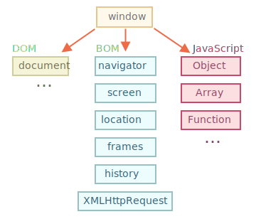

# 브라우저 환경과 다양한 명세

자바스크립트는 본래 웹 브라우저에서 사용하려고 만들어진 언어입니다. 이후 진화를 거쳐 다양한 사용처와 플랫폼을 지원하는 언어로 변모하였습니다.   

자바스크립트가 돌아가는 플랫폼은 *호스트(host)* 라고 불립니다. 호스트는 브라우저, 웹서버, 심지어는 커피 머신이 될 수도 있습니다. 각 플랫폼은 해당 플랫폼에 특정되는 기능을 제공하는데, 자바스크립트 명세에선 이를 *호스트 환경(host environment)* 이라고 부릅니다.

호스트 환경은 랭귀지 코어(ECMAScript)에 더하여 플랫폼에 특정되는 객체와 함수를 제공합니다. 웹브라우저는 웹페이지를 제어하기 위한 수단을 제공하고, Node.js는 서버 사이드 기능을 제공해주죠.

아래는 호스트 환경이 웹 브라우저일 때 사용할 수 있는 기능을 개괄적으로 보여주는 그림입니다.



최상단엔 `window` 객체가 있습니다. 이 객체는 2가지 역할을 합니다.

1. <info:global-object>에서 설명한 바와 같이, 자바스크립트 코드의 전역 객체입니다. 
2. "브라우저 창(browser window)"을 대변하고, 이를 제어할 수 있는 메서드를 제공합니다.

아래 예시는 `window` 객체를 전역 객체로 사용하고 있습니다.

```js run
function sayHi() {
  alert("안녕하세요");
}

// 전역 함수는 전역 객체(window)의 메서드임
window.sayHi();
```

아래 예시에선 `window` 객체가 브라우저 창을 대변하고 있으며, 이를 이용해 창의 높이를 출력합니다.

```js run
alert(window.innerHeight); // 창 내부 높이
```

`window` 객체에 관련된 다양한 메서드와 프로퍼티는 추후 자세히 살펴보도록 하겠습니다.

## DOM(문서 객체 모델)

Document Object Model, or DOM for short, represents all page content as objects that can be modified.

The `document` object is the main "entry point" to the page. We can change or create anything on the page using it.

예시:
```js run
// 배경을 붉은색으로 변경하기
document.body.style.background = "red";

// 1초 후 원상태로 복구하기
setTimeout(() => document.body.style.background = "", 1000);
```

문서 객체는 예시에서 소개한 `document.body.style` 외에도 수많은 기능을 제공합니다. 문서 객체의 프로퍼티와 메서드에 대한 설명은 명세(specification)에서 찾을 수 있습니다.

- **DOM에 관한 표준** 은 <https://dom.spec.whatwg.org>에서 확인할 수 있습니다.

```smart header="DOM is not only for browsers"
The DOM specification explains the structure of a document and provides objects to manipulate it. There are non-browser instruments that use DOM too.

For instance, server-side scripts that download HTML pages and process them can also use DOM. They may support only a part of the specification though.
```

```smart header="CSSOM for styling"
CSS rules and stylesheets are structured in a different way than HTML. There's a separate specification [CSSOM](https://www.w3.org/TR/cssom-1/) that explains how they are represented as objects, and how to read and write them.

CSSOM is used together with DOM when we modify style rules for the document. In practice though, CSSOM is rarely required, because usually CSS rules are static. We rarely need to add/remove CSS rules from JavaScript, but that's also possible.
```

## BOM(브라우저 객체 모델)

브라우저 객체 모델(Browser Object Model, BOM)은 HTML 명세의 일부로, 문서 이외의 모든 것을 제어하기 위해 브라우저(호스트 환경)가 제공하는 추가적인 객체입니다.

예시:

- [navigator](mdn:api/Window/navigator) 객체를 이용하면 브라우저와 운영체제에 대한 정보를 얻을 수 있습니다. 이 객체엔 많은 프로퍼티가 있지만, 가장 많이 알려진 프로퍼티는 현재 사용 중인 브라우저를 판단하는 데 쓰이는 `navigator.userAgent`와 브라우저가 실행 중인 운영체제(Windows, Linux, Mac 등)를 알아내는 데 쓰이는 `navigator.platform`입니다.  
- [location](mdn:api/Window/location) 객체는 현재 창의 URL 정보를 제공합니다. 또한 새로운 URL로 변경(redirect)할 수 있는 기능을 제공합니다.

예제를 통해 `location` 객체의 용례를 살펴봅시다.

```js run
alert(location.href); // 현재 URL을 보여줌
if (confirm("위키피디아 페이지로 가시겠습니까?")) {
  location.href = "https://wikipedia.org"; // 새로운 페이지로 넘어감
}
```

메서드 `alert/confirm/prompt` 역시 BOM의 일부입니다. 문서와 직접 연결되어 있지 않지만, 사용자와 브라우저 사이의 커뮤니케이션을 도와주는 순수 브라우저 메서드이죠.  

BOM은 [HTML 명세](https://html.spec.whatwg.org)에 속합니다.

이상하게 들리겠지만, 맞습니다. <https://html.spec.whatwg.org>에서 볼 수 있는 HTML 명세는 태그(tag)나 속성(attribute) 같은 "HTML 언어"만 다루지 않습니다. 다양한 객체와 메서드, 특정 브라우저에 종속되는 DOM 확장도 다룹니다. 넓게 보면 이 모든 것이 HTML에 속하기 때문입니다. <https://spec.whatwg.org>에도 몇몇 추가 스펙이 명시되어 있습니다.

## 요약

표준에 대하여 이야기하면서 다음 명세들을 알아보았습니다.

DOM 명세
: 문서 구조, 조작, 이벤트를 설명하고, <https://dom.spec.whatwg.org>에서 볼 수 있습니다.

CSSOM 명세
: CSS와 스타일시트에 대한 규칙, 자바스크립트로 문서 스타일을 조작하는 방법에 대해 설명하고, <https://www.w3.org/TR/cssom-1/>에서 볼 수 있습니다.

HTML 명세
: 태그와 같은 HTML 언어, `setTimeout`, `alert`, `location` 등의 다양한 브라우저 기능을 정의한 BOM(browser object model)에 관해 설명하고, <https://html.spec.whatwg.org>에서 볼 수 있습니다. DOM 명세에 추가적인 프로퍼티와 메서드를 더해 확장한 명세입니다.

Additionally, some classes are described separately at <https://spec.whatwg.org/>.

Please note these links, as there's so much stuff to learn it's impossible to cover and remember everything.

When you'd like to read about a property or a method, the Mozilla manual at <https://developer.mozilla.org/en-US/search> is also a nice resource, but the corresponding spec may be better: it's more complex and longer to read, but will make your fundamental knowledge sound and complete.

To find something, it's often convenient to use an internet search "WHATWG [term]" or "MDN [term]", e.g <https://google.com?q=whatwg+localstorage>, <https://google.com?q=mdn+localstorage>.

Now we'll get down to learning DOM, because the document plays the central role in the UI.
