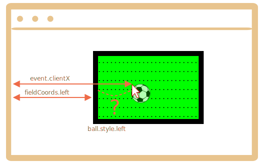

우선 공을 배치하는 방법을 선택해야 합니다.

페이지를 스크롤하면 공이 필드에서 이동하므로, `position:fixed`를 사용할 수 없습니다.

그래서 `position:absolute`를 사용해야 하고 위치를 확고히 하기 위해서 `field` 자체를 포지셔닝해야 합니다.

그리고 공을 필드에 상대적으로 배치시킵니다:

```css
#field {
  width: 200px;
  height: 150px;
  position: relative;
}

#ball {
  position: absolute;
  left: 0; /* 상대적으로 가장가까운 위치에 있는 조상(필드) */
  top: 0;
  transition: 1s all; /* CSS 애니메이션으로 왼쪽/위쪽으로 공이 날아가요 */
}
```

그런 다음 올바른 `ball.style.left/top`를 할당해야 합니다. 이제 상대적인 필드 기준 좌표가 포함되죠.

여기 사진이 있어요:



`event.clientX/clientY`가 있습니다. -- 클릭 window-relative 좌표를 표시합니다.

클릭 field-relative `left` 좌표를 얻으려면, 필드 왼쪽 가장자리와 테두리 너비를 빼면 됩니다:

```js
let left = event.clientX - fieldCoords.left - field.clientLeft;
```

일반적으로, `ball.style.left`는 "요소의 왼쪽 가장자리"(공)를 의미합니다. 따라서 `left`를 할당하면 중앙이 아닌 공 가장자리가 마우스 커서 아래에 있게 됩니다.

중앙으로 가게 만드려면 공을 왼쪽으로 반-너비, 위쪽으로 반-높이 이동해야 합니다.

자, 따라서 `left`은 다음과 같습니다:

```js
let left = event.clientX - fieldCoords.left - field.clientLeft - ball.offsetWidth/2;
```

수직 좌표는 동일한 논리를 사용하여 계산됩니다.

이때 공의 너비/높이는 `ball.offsetWidth`에 엑세스 할 때 알아야 한다는 것을 주의해주세요. HTML 혹은 CSS로 지정해야 합니다.
