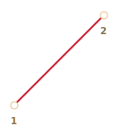
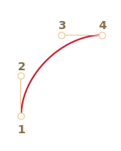
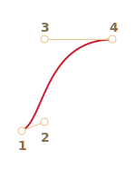
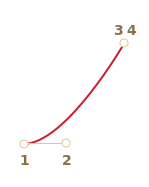
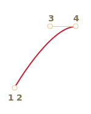
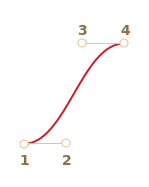
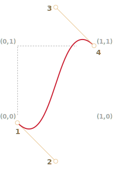

# CSS 애니메이션

CSS 애니메이션을 사용하면 자바스크립트 없이도 간단한 애니메이션을 만들 수 있습니다.

자바스크립트는 CSS 애니메이션을 제어하고 보다 짧은 코드로 훨씬 더 효과적인 애니메이션을 만듭니다.

## CSS 트랜지션 [#css-transition]

CSS 트랜지션의 원리는 간단합니다. 프로퍼티에 어떻게 애니메이션 시킬지에 대한 값을 입력하면 됩니다. 입력한 프로퍼티가 변할 때, 브라우저에 애니메이션이 보이게 됩니다.

즉, 프로퍼티를 변하게 해야 합니다. 그래야 브라우저를 통해 자연스러운 전환이 됩니다.

예를 들어 아래에 있는 CSS는 3초 동안 `background-color`를 변하게 합니다.

```css
.animated {
  transition-property: background-color;
  transition-duration: 3s;
}
```

이제 어떤 요소가 `.animated` 클래스를 가지고 있다면,  `background-color`는 3초 동안 변하게 됩니다.

아래 버튼을 클릭해 배경을 변화시켜보세요.

```html run autorun height=60
<button id="color">클릭하기</button>

<style>
  #color {
    transition-property: background-color;
    transition-duration: 3s;
  }
</style>

<script>
  color.onclick = function() {
    this.style.backgroundColor = 'red';
  };
</script>
```

CSS 프로퍼티와 관련된 프로퍼티 네 가지는 다음과 같습니다.

- `transition-property`
- `transition-duration`
- `transition-timing-function`
- `transition-delay`

이 네 가지 프로퍼티는 잠시 후에 다루도록 하고, 지금은 흔히 쓰이는 `transition` 프로퍼티가 어떤 순서대로 네 가지 프로퍼티를 선언하는지 알아봅시다. `property duration timing-function delay`의 순서로 한 번에 선언이 가능합니다.

예를 들어 아래의 버튼은 `color`와 `font-size`에 애니메이션 효과가 나타납니다.

```html run height=80 autorun no-beautify
<button id="growing">클릭하기</button>

<style>
#growing {
*!*
  transition: font-size 3s, color 2s;
*/!*
}
</style>

<script>
growing.onclick = function() {
  this.style.fontSize = '36px';
  this.style.color = 'red';
};
</script>
```

이제 애니메이션 프로퍼티에 대해 하나씩 살펴봅시다.

## 'transition-property' 프로퍼티

`transition-property` 프로퍼티를 통해 `left`, `margin-left`, `height`, `color`와 같은 애니메이션을 위한 프로퍼티 목록을 작성할 수 있습니다.

모든 프로퍼티가 애니메이션 효과를 나타낼 순 없지만, [많은 프로퍼티](http://www.w3.org/TR/css3-transitions/#animatable-properties-)가 가능합니다. 프로퍼티의 값인 `all`은 모든 프로퍼티가 전환될 수 있음을 의미합니다.

## 'transition-duration' 프로퍼티

`transition-duration` 프로퍼티를 통해 애니메이션 시간이 얼마나 걸릴지 설정할 수 있습니다. 시간은 [CSS 시간 단위](http://www.w3.org/TR/css3-values/#time)인 초 단위를 나타내는 `s` 또는 밀리초 단위를 나타내는 `ms`를 사용해야 합니다.

## 'transition-delay' 프로퍼티

`transition-delay` 프로퍼티를 통해 애니메이션 *시작 전*의 지연 시간을 설정할 수 있습니다. 예를 들어 `transition-delay: 1s`이면, 애니메이션은 1초 후에 나타나게 됩니다.

음의 값도 가능합니다. 그러면 애니메이션은 중간부터 시작하게 됩니다. 예를 들어 `transition-duration`이 `2s`이고, 지연 시간은 `-1s`일 때, 애니메이션은 1초가 걸리고 딱 중간부터 시작합니다.

여기 CSS `translate` 프로퍼티를 사용하여 `0`부터 `9`까지 숫자가 변하는 애니메이션이 있습니다.

[codetabs src="digits"]

`transform` 프로퍼티는 다음과 같이 작성되었습니다.

```css
#stripe.animate {
  transform: translate(-90%);
  transition-property: transform;
  transition-duration: 9s;
}
```

위의 예시에서 자바스크립트는 요소에 `.animate`라는 이름의 클래스를 추가했습니다. 그리고 애니메이션이 나타납니다.

```js
stripe.classList.add('animate');
```

또한 `transition-delay`에서 음의 값을 사용하여, 특정 숫자에서(예: 현재 2초에 해당하는 숫자) '중간부터' 시작할 수 있다.

여기 숫자를 클릭하면 현재 2초에 해당하는 숫자부터 애니메이션이 시작될 것입니다.

[codetabs src="digits-negative-delay"]

자바스크립트에서는 위의 내용을 별도의 행으로 실행합니다.

```js
stripe.onclick = function() {
  let sec = new Date().getSeconds() % 10;
*!*
  // 예를 들어, 여기에서의 -3s는 3초부터 애니메이션을 시작합니다.
  stripe.style.transitionDelay = '-' + sec + 's';
*/!*
  stripe.classList.add('animate');
};
```

## 'transition-timing-function' 프로퍼티

함수 Timing에서는 애니메이션 프로세스가 시간에 따라 어떻게 분배되는지를 설정합니다. 애니메이션 프로세스가 천천히 시작하다가 빠르게 진행되거나 반대로 진행될 것입니다.

처음 보면 복잡한 프로퍼티로 느껴질 수 있습니다. 하지만 시간을 조금만 투자하면 매우 간단해집니다.

이 프로퍼티의 값으로는 베지어 곡선(Bezier curve)과 단계(Steps) 값이 가능합니다. 조금 더 자주 쓰이는 베지어 곡선부터 알아봅시다.

### 베지어 곡선(Bezier curve)

함수 Timing에서는 아래의 조건을 만족하는 4개의 제어점을 가진 [베지어 곡선](/bezier-curve)을 설정할 수 있습니다.

1. 첫번째 제어점: `(0,0)`
2. 마지막 제어점: `(1,1)`
3. 중간 제어점들의 `x`값은 `0..1`구간이어야 하며, `y`값은 어떤 값이든 가능합니다.

CSS의 베지어 곡선 문법은 `cubic-bezier(x2, y2, x3, y3)`입니다. 여기서 첫 번째 제어점은 `(0,0)`으로, 네 번째 제어점은 `(1,1)`로 고정되어 있으므로 두 번째와 세 번째 제어점만 설정하면 됩니다.

함수 Timing을 통해 애니메이션 프로세스가 시간 내에 얼마나 빨리 진행되는지 설정할 수 있습니다.

- `x`축은 시간을 의미합니다. `0`은 `transition-duration`의 시작하는 시간을, `1`은 끝나는 시간을 나타내죠.
- `y`축은 프로세스의 완성을 명시합니다. `0`은 프로퍼티의 시작 상태를, `1`은 최종 상태를 나타내죠.

가장 간단한 변형은 애니메이션이 같은 선형 속도로 균일하게 진행되는 경우입니다. `cubic-bezier(0, 0, 1, 1)`로 설정할 수 있습니다.

그러면 아래의 곡선과 같은 모양이 나옵니다.



보시다시피, 그냥 직선입니다. 시간(`x`)이 지나면서, 애니메이션의 완성도(`y`)가 `0`에서 `1`로 꾸준히 올라갑니다.

아래 기차를 클릭하여, 기차가 일정한 속도로 왼쪽에서 오른쪽으로 이동하는 것을 확인해보세요.

[codetabs src="train-linear"]

위에서 본 직선에 기초하여 작성한 CSS `transition` 입니다.

```css
.train {
  left: 0;
  transition: left 5s cubic-bezier(0, 0, 1, 1);
  /* 자바스크립트에서 450px 왼쪽으로 설정됨 */
}
```

그러면 어떻게 기차가 느려지는 것을 볼 수 있을까요?

또 다른 베지어 곡선 `cubic-bezier(0.0, 0.5, 0.5 ,1.0)`을 사용하면 됩니다.

곡선 그래프:



그래프에서 볼 수 있듯이 프로세스는 빠르게 시작되었다가, 즉 곡선이 높이 솟았다가 점점 느려집니다.

기차를 클릭하여 함수 Timing의 움직임을 확인해보세요.

[codetabs src="train"]

CSS:
```css
.train {
  left: 0;
  transition: left 5s cubic-bezier(0, .5, .5, 1);
  /* 자바스크립트에서 450px 왼쪽으로 설정됨 */
}
```

내장 곡선으로는 `linear`, `ease`, `ease-in`, `ease-out`, `ease-in-out` 등이 있습니다.

`linear`는 위에서 본 직선인 `cubic-bezier(0, 0, 1, 1)`의 단축 구문입니다.

다음은 `cubic-bezier`의 또 다른 단축 구문입니다.

| <code>ease</code><sup>*</sup> | <code>ease-in</code> | <code>ease-out</code> | <code>ease-in-out</code> |
|-------------------------------|----------------------|-----------------------|--------------------------|
| <code>(0.25, 0.1, 0.25, 1.0)</code> | <code>(0.42, 0, 1.0, 1.0)</code> | <code>(0, 0, 0.58, 1.0)</code> | <code>(0.42, 0, 0.58, 1.0)</code> |
|  |  |  |  |

`*`은 기본값으로, 함수 Timing이 없을 때 `ease`가 사용됩니다.

기차가 느려지도록 하려면 `ease-out`을 사용할 수 있습니다.


```css
.train {
  left: 0;
  transition: left 5s ease-out;
  /* transition: left 5s cubic-bezier(0, .5, .5, 1); */
}
```

하지만 조금 다르게 보입니다.

**베지어 곡선으로 애니메이션의 범위를 '뛰어 넘게' 할 수 있습니다.**

베지어 곡선에서 제어점의 `y` 좌표는 음수 또는 큰 값까지 가질 수 있습니다. 음수 또는 큰 값을 가지면 베지어 곡선도 매우 낮거나 높게 그려지면서, 애니메이션이 정상 범위를 벗어나게 됩니다.

아래 예시의 애니메이션 코드는 다음과 같습니다.
```css
.train {
  left: 100px;
  transition: left 5s cubic-bezier(.5, -1, .5, 2);
  /* 자바스크립트에서 400px 왼쪽으로 설정됨 */
}
```

`left` 프로퍼티를 통해 `100px`에서 `400px`로 이동해야 합니다.

하지만 기차를 클릭하면 다음과 같이 나타납니다.

- 기차는 먼저 `left`로 `100px` 조금 안되게 *뒤로* 이동합니다.
- 그리고는 `400px`보다 조금 더 앞으로 이동합니다.
- 그리고 다시 `400px` 위치로 뒤로 이동합니다.

[codetabs src="train-over"]

왜 이렇게 이동하는지 아래의 베지어 곡선 그래프를 보면 아주 명확히 알 수 있죠.



두 번째 제어점의 `y` 좌표를 0 아래로 이동시키고 세 번째 제어점은 `1`이 넘게 이동시켜서, 곡선이 '일반' 사분면을 벗어나게 되었습니다. `y` 좌표는 '정상' 범위인 `0..1`을 벗어났죠.

아시다시피, `y` 좌표는 '애니메이션 프로세스의 완성'을 나타냅니다. `y = 0`인 값은 프로퍼티가 시작하는 값을, `y = 1`인 값은 끝나는 값을 의미합니다. 그래서 `y<0` 값은 시작하는 `left`보다 낮은 프로퍼티를 움직이고, `y>1` 값은 끝나는 `left`를 넘는 프로퍼티를 움직입니다.

확실히 '부드러운' 변형이죠. `y` 값으로 `-99`나 `99`를 넣으면 기차가 훨씬 더 멀리 뛰어오릅니다.

하지만 명확한 애니메이션을 위해서 베지어 곡선을 어떻게 만들어야 할까요? 많은 툴이 있습니다. 예를 들어, <http://cubic-bezier.com/>에서 베지어 곡선을 만들 수 있습니다.

### 단계(Steps)

함수 Timing의 값 `steps(number of steps[, start/end])`를 통해 애니메이션을 여러 단계로 나눌 수 있습니다.

아래 숫자로 된 예시를 봅시다.

애니메이션이 없는 숫자의 나열이죠.

[codetabs src="step-list"]

빨간 '네모박스'밖에 있는 부분은 눈에 보이지 않게 만들고 단계별로 숫자 목록을 왼쪽으로 이동 시켜 숫자가 하나씩 나타나게 해봅시다.

숫자가 하나씩 이동하기에 총 9단계로 나타납니다.

```css
#stripe.animate  {
  transform: translate(-90%);
  transition: transform 9s *!*steps(9, start)*/!*;
}
```

동작:

[codetabs src="step"]

`steps(9, start)`의 첫 번째 인수는 단계 수입니다. 각 10%씩 9단계로 분할되어 변환됩니다. 시간 간격도 자동으로 9단계로 나뉘어, `transition: 9s`는 전체 애니메이션에 대해 9초(숫자 당 1초)를 줍니다.

두 번째 인수는 `start` 또는 `end` 둘 중 하나입니다.

`start`는 애니메이션이 바로 첫 번째 단계부터 시작함을 의미합니다.

숫자를 클릭하면 바로 첫 단계인 `1`로 바뀌고, 그다음 초가 되면 다음 단계로 바뀌는 것을 볼 수 있습니다.

애니메이션 과정은 아래와 같이 진행됩니다.

- `0s` -- `-10%` (첫 번째 초에 바로 첫 변화 생김)
- `1s` -- `-20%`
- ...
- `8s` -- `-80%`
- (마지막 초에 최종값 나타남).

`end`는 애니메이션이 바로 시작하지 않고 각 초가 끝날 때 시작함을 의미합니다.

애니메이션 과정은 다음과 같습니다.

- `0s` -- `0`
- `1s` -- `-10%` (첫 번째 초가 끝날 때 첫 변화 생김)
- `2s` -- `-20%`
- ...
- `9s` -- `-90%`

첫 번째 숫자 변화 사이의 일시 중지를 참고하여 `steps(9, end)`의 동작을 봅시다.

[codetabs src="step-end"]

단축 구문 값도 있습니다.

- `step-start`는 `steps(1, start)`와 같습니다. 즉, 애니메이션의 첫 단계가 바로 시작되죠. 그래서 애니메이션이 없었던 것처럼 바로 시작하고 끝납니다.
- `step-end`는 `steps(1, end)`와 같으며, `transition-duration`의 끝에서 애니메이션의 한 단계가 진행됩니다.

위의 값들은 거의 사용되지 않는데, 실제 애니메이션이 아니라 한 단계마다 변화하기 때문입니다.

## 'transitionend' 이벤트

CSS 애니메이션이 끝나면 `transitionend` 이벤트가 트리거됩니다.

애니메이션이 끝난 후 작동한다고 많이 알고 있죠. 애니메이션과 함께 쓰기도 합니다.

예를 들어, 아래 예시의 배를 보면 오른쪽으로 가다가 다시 뒤로 가는데, 점점 오른쪽으로 멀어집니다.

[iframe src="boat" height=300 edit link]

전환이 끝날 때마다 다시 실행되어 방향을 뒤집는 함수인 `go`에 의해 애니메이션이 시작됩니다.

```js
boat.onclick = function() {
  //...
  let times = 1;

  function go() {
    if (times % 2) {
      // 오른쪽으로 가기
      boat.classList.remove('back');
      boat.style.marginLeft = 100 * times + 200 + 'px';
    } else {
      // 왼쪽으로 가기
      boat.classList.add('back');
      boat.style.marginLeft = 100 * times - 200 + 'px';
    }

  }

  go();

  boat.addEventListener('transitionend', function() {
    times++;
    go();
  });
};
```

`transitionend` 이벤트에는 약간의 특정 프로퍼티가 있습니다.

`event.propertyName`
: 애니메이션을 완료한 프로퍼티로, 여러 프로퍼티를 동시에 애니메이션 시킬 때 좋을 수 있습니다.

`event.elapsedTime`
: `transition-delay` 없이 애니메이션이 걸린 시간(초)을 나타냅니다.

## 키프레임(Keyframes)

CSS 문법인 `@keyframes`을 사용하면 여러 가지 애니메이션을 함께 사용할 수 있습니다.

애니메이션과 무엇을, 언제, 어디서 작동하게 할지에 대한 문법의 '이름'을 설정합니다. 그런 다음 `animation` 프로퍼티를 사용하여 설정한 애니메이션의 이름을 요소에 작성하고, 추가 매개변수를 지정합니다.

설명이 있는 예시를 봅시다.

```html run height=60 autorun="no-epub" no-beautify
<div class="progress"></div>

<style>
*!*
  @keyframes go-left-right {        /* 애니메이션 이름 지정 name: "go-left-right" */
    from { left: 0px; }             /* 여기서부터 left: 0px */
    to { left: calc(100% - 50px); } /* 여기까지 이동 left: 100%-50px */
  }
*/!*

  .progress {
*!*
    animation: go-left-right 3s infinite alternate;
    /* 요소에 "go-left-right" 애니메이션 적용
       지속시간 3초
       반복 횟수: 무한
       매번 정해진 방향으로 갔다가 반대 방향으로 감
    */
*/!*

    position: relative;
    border: 2px solid green;
    width: 50px;
    height: 20px;
    background: lime;
  }
</style>
```

`@keyframes`과 [상세 설명](https://drafts.csswg.org/css-animations/)에 대한 많은 기사가 있습니다.

사이트에 있는 모든 것이 계속 움직이지 않는 한, `@keyframes`을 쓸 일은 많지 않을 것입니다.

## 요약

CSS 애니메이션으로 하나 또는 여러 CSS 프로퍼티의 변화를 부드럽게(또는 그렇지 않게) 만들 수 있습니다.

대부분 애니메이션 과제에 도움이 됩니다. 자바스크립트를 사용해서도 애니메이션을 나타낼 수 있는데, 다음 챕터에서 다룰 예정입니다.

다음은 자바스크립트 애니메이션과 비교한 CSS 애니메이션의 장단점입니다.

```compare plus="CSS animations" minus="JavaScript animations"
+ 간단한 애니메이션은 간단히 수행됨
+ CPU를 위한 빠르고 가벼운 기능
- 자바스크립트 애니메이션은 유연하여, 요소의 '폭발'과 같은 어떤 애니메이션 로직(logic)도 구현 가능
- 단지 프로퍼티의 변화가 아니라, 애니메이션을 목적으로 자바스크립트에서 새로운 요소를 만들 수 있음
```

대부분의 애니메이션은 이번 챕터에 설명된 CSS를 사용하여 구현할 수 있습니다. 그리고 `transitionend` 이벤트에서는 애니메이션이 끝난 후 자바스크립트를 실행할 수 있어 코드와 잘 통합됩니다.

하지만 좀 더 복잡한 사례를 다루기 위해 다음 챕터에서는 자바스크립트 애니메이션을 몇 가지 보도록 하겠습니다.
